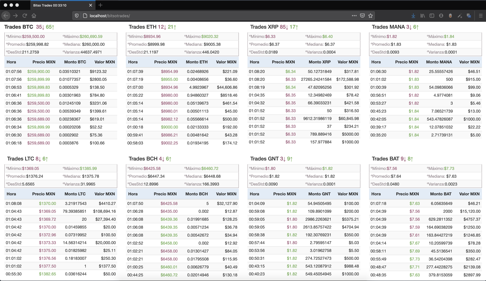

# bitso_livetrades
Tablero de trades Bitso en tiempo real, BTC - ETH - XRP - MANA - LTC - BCH - GNT - BAT 
Muestra medidas de tendencia centrar por moneta [Minimo, Maximo, Promedio, Mediana, Desviación Estandar, Varianza] &lt;- Para los analistas. 

Persistencia no implementada, datos que muestra al recargar el sitio son borrados. 
Hora de inicio en título se actualiza cada que se recarga. Hace conteo de trades al alza en verde y baja en rojo. Colores y estilo referentes a Bitso.com

Se recarga la aplicación a las cero horas, para comenzar a escuchar nuevamente.

Tiene la opción de mandar notificaciones por medio de Telegram, se necesita configuar un Telegram Bot y copiar tu TelegramBotKey y tu ChatID. Puedes implementar las notificaciones necesarias y modificar el mensaje default.

Si eres desarrollador y deseas agregar funcionalidad contactame o manda tu pullRequest.
Aun trabajo en la estructura, separar CSS de Js y HTML. Anque mejor hice NetCore aplication C#

Si tienes servidor apache con PHP, solo copia el proyecto y accede al URL, de lo contrario solo doble click al archivo page.html para abrirlo directo en tu explorador default.

